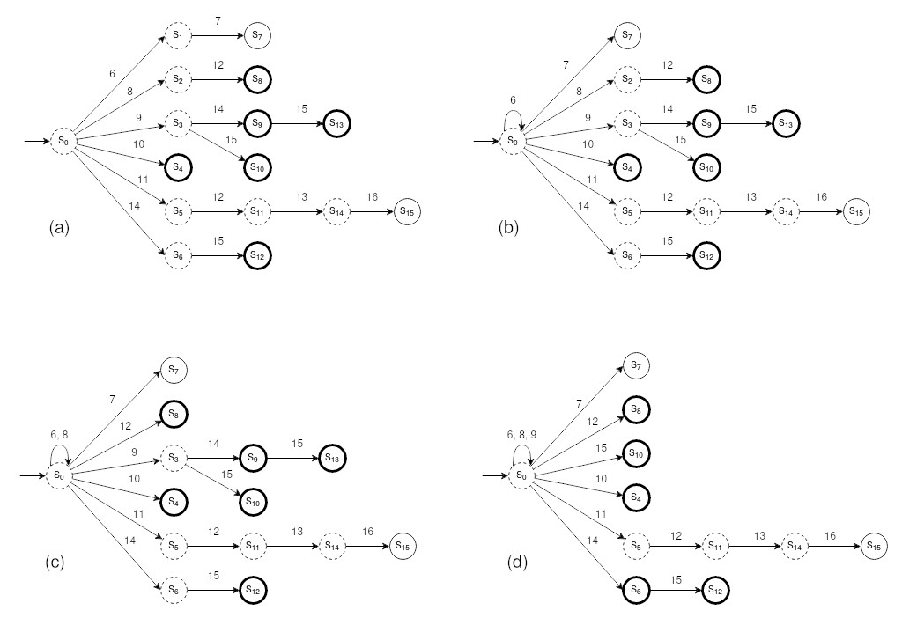

# tesis-leishmaniasis
Experimentos e Implementación de Algoritmos en Python y Jupyter de mi Tesis en la Javeriana Cali 2021-2 con título "**Predicción del tratamiento para la leishmaniasis cutánea mediante datos génicos e inferencia gramatical**".

# Objetivo
Predecir la efectividad del tratamiento con Glucantime para la leishmaniasis cutánea empleando técnicas de inferencia gramatical con base en los datos génicos de pacientes.

# Dependencias
Paquetes usados para correr el proyecto desde Linux.

## Jupyter
- `jupyter-notebook==6.1.4`

## Python 3
Usar pip/pip3 o equivalente para instalar paquetes.

- `seaborn==0.11.0`
- `pandas==1.1.2`
- `scikit-learn==0.23.2`
- `numpy==1.16.4`

# Uso
- Clonar repositorio
- Instalar dependencias
- Abrir cuadernos en Jupyter y correrlos

# Notas
- Multiples funciones como la de validación cruzada están implementadas directamente en el cuaderno `experimentos.ipynb`.
- Se incluyen versiones en .py de los 2 cuadernos de Jupyter `experimentos.ipynb` y `lista_de_genes_alfabetos.ipynb`.
- `lista_de_genes_alfabetos.ipynb` permite consultar los genes seleccionados para cada tipo de célula y para cada tamaño de alfabeto usados en todos los experimentos.
- En `oilnsym-codigo/` está el codigo fuente y Makefile correspondiente para compilar el algoritmo OIL implementado en C++.
- `oilnsym` es un archivo binario, debe marcarse como ejecutable para que el wrapper OIL.py pueda utilizarlo.
- Las funciones en `RPNI.py` y `utilities.py` cuentan con documentación sobre sus entradas y salidas.
- Los archivos de excel o conjuntos de datos no están incluidos ya que son informacion confidencial. De tener acceso a estos, crear carpeta `data/`, agregarlos a esta, y actualizar las rutas que importan los mismos en los cuadernos de Jupyter.
